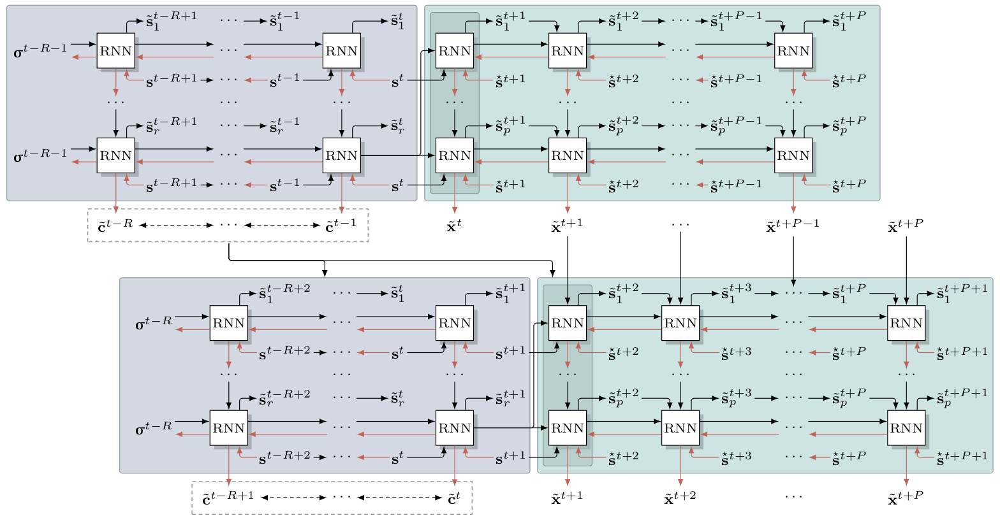

Theory
======

Presented in [REPRISE]_.

   This is the caption of the figure (a simple paragraph).

.. [REPRISE] Butz, M. V., Bilkey, D., Humaidan, D., Knott, A., & Otte, S. (2019). Learning, planning, and control in a monolithic neural event inference architecture. Neural Networks, 117, 135-144.
